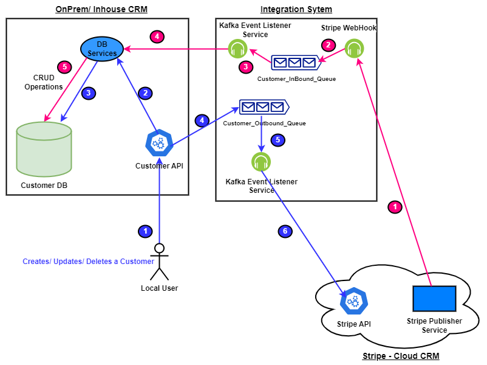

# Two-Way Integration

## 1. Overview

We have a local customer catalog that we access through a RESTful API server. We need to build a two-way integration with a customer catalog in an external service - Stripe in this case. The two-way sync should be near real-time so that a customer added/edited on one system propagates to the other system within a few seconds. The goal is to build this in a way such that you can add other integrations with the customer catalog and other integrations with other catalogs (like, say, an invoice catalog) in the future.

## 2. Components

We use the following technologies in our project. The detailed use case of each is explained in later sections:

- Docker/docker-compose:
  - Zookeeper
  - Kafka: Asynchronous communication channel between the source and integration servers
  - Postgres
- FastAPI server (source): Hosts API to interact with the database. All DB processes happen through the APIs.
- Flask server (integration): This is the integration server. It acts as a webhook which is triggered on customer events in Stripe.

## 3. Architecture

    

The end-to-end architecture is explained in detail below. We can divide our architecture into 2 main parts:

- **Source**
- **Integration**

### 3.1 Source / Outbound

In this section, we describe the outbound flow from the OnPrem CRM to the Stripe - External CRM system (in this case, Stripe).

#### Components

In the outbound section, we deal with all the components that aid us in local customer handling. We have 3 main parts:

- **Database**:
  - We use a PostgreSQL instance deployed in a container as our database with standard configurations controlled in the `docker-compose.yaml` file.
  - Schema: We can notice the schema in the `db/init.sql` file. We have 2 tables:
    - `customer`: This table stores customer data that is in sync with the Stripe integration.
    - `id_mapping`: This table records the mapping of the local id of the customer (in the customer table of the PostgreSQL instance) and the id in Stripe for a customer.
    - I plan to add a few normalized tables that would help in integration with Salesforce (and others as well!).

- **ORM**:
  - We use SQLAlchemy as the ORM. The goal was to keep the application as modular as possible. Each service performs a specific task. Instances of one service is called in the dependent services. This allows unit testing of services as well, without worrying about dependency issues. So, the db access is divided into 3 distinct services, which can be found in the `./db/` dir.
    - Models: This service creates model classes for each table.
    - Repository: creates instances of base, engine and sessions
    - Service: The functionality of this is two fold.
        - This is the only point of contact to the source for db requests. 
        - It handles basic CRUD logic and custom logic for our database.

- **Server**:
  - FastAPI server that uses an instance of the db.service class. It exposes api endpoints that we can use to operate on customers locally.
  - Any db operation, after it is performed in the postgres db, is queued using kafka on the `stripe-outgoing` topic.
  - On startup, it starts a background worker (on a separate thread), that acts as a consumer for the `stripe-incoming` topic. It performs the necessary db operation using the service on incoming messages in this topic.

#### New User creation OnPrem CRM

Let us run through how our services will handle the addition of a new user:

1. User invokes the customer API with the customer details and POSTs the data to create the user record. This API invokes the DB Services to act with the Database. The Create Service checks if the Customer already exists in the system. If it exists, then it updates the data; otherwise, it creates a New One. There are two tables in the Database for Customer:
    - `customer`: This is the main table stores customer data that is in sync with the stripe integration.
    - `id_mapping`: This table records the mapping of local customer id of the customer and the id in stripe for a customer. We need this mapping as the local Id is different from the one in the external systems.
2. After the data is persisted in the database, the customer event is posted to the Kafka Topic `stripe-outgoing` to sync the data with the Stripe system. The transaction is committed after successfully posting the event to the Kafka Topic, and a success response is sent back to the user invoking the create API.
3. We have a Consumer listening to the Kafka Topic `stripe-outgoing`. This gets the event of the customer and posts it to the Stripe Endpoint to Create/Modify the customer details. On successful processing of the data, a commit is triggered to have the data from the Kafka Topic removed; else, the transaction is rolled back, and the message remains in the Queue. Failures in data processing can happen due to the endpoint down, network connectivity issues, and data issues as well.
4. At the end of this flow, a new Customer would be created in the Local CRM system, and the same would be synced to the Stripe System. This same process would work for Update and Delete of the customers in the local CRM system.

**Salient points of the design**:

- Kafka Consumer would process one message at a time: Even though the Kafka consumer can process multiple messages at the same time, we will restrict one message at a time as we would need to maintain the creation sequence at the input. Even though the Kafka Topic would maintain the Sequence, the HTTP calls from the listener would not maintain it, and if we have a Create/Delete of a new Customer, then to maintain the same Order, we will run One message at a time.
- By having the "id_mapping" table, we have a correlation of the Local CRM Customer CRM Id to the external Id. This way, any inbound messages can be processed and synced. This table has 2 columns currently - `local-id` and `integration_id`. I plan to add another column - `remote_system` to help with integration with Salesforce. Even if two remote systems have the same Id, this design would take care of it.
- If we need to add a new CRM system like Sales Force, we would need to create an additional listener to the Kafka Topic and invoke the Sales Force Endpoint to have the data synced.

### 3.2 Integration / Inbound

In this section, we describe the Inbound flow from the Stripe CRM to the On-Prem CRM. A new customer is created on the Stripe CRM or an existing Customer is Modified then this flow takes care.

#### Components

Can be found in the `./source/` dir:
- **Stripe-Service**:
  - To support modularity and extensibility of the integration server, all api classes to stripe for customer CRUD operations are defined in this service. It deals with all the logic related to stripe calls.
  - An instance of this is used in the server which calls methods.
- **Server**:
  - A Flask server is used which is the only interactor with the stripe integration. Any message which is sent from source has to be queued to this server, which then decides the appropriate action.
  - A public domain is created for this sevrer using ngrok which is then added a webhook in stripe. It is configured to be triggered only on events dealing with stripe customer creation, updation and deletion.
  - An instance of kafkaConsumer and kafkaProducer is created in the server (`source/app.py`):
    - Consumer: It is a background worker that is created on the startup of the server. It listens to the `stripe-outgoing` topic for messages related to CRD operation on customers in the source server, which then uses methods defined in the `stripe-service`.
    - Producer: When the webhook is triggered, the server writes a message to the `stripe-incoming` topic, which is then used by the source server to make local db changes.

**User creation/ Updation on Stripe CRM**

1. Customer is Created/Updated/Deleted on Stripe CRM.
2. A Webhook is configured on Stripe system that gets triggered when any changes happen to the customer profile in Stripe. The Webhook configured is an API that gets invoked from Stripe on customer changes.
3. When a Customer data gets modified, the API gets invoked with the customer data on Stripe, this API posts the Customer data received to the Kafka Topic `stripe-incoming` and returns a Success message post this, if Any issues with posting the message to the Queue a Failure message would be sent back.
4. We have a Kafka Listener service listening to the topic `stripe-incoming`, which when receives a Message invokes a DB service to persist the data to the DB based on the action - Insert/Update/Delete. The sequence of steps performed by the DB service are:
    - Get the Local Id for the Stripe Id and Remote system Stripe and then perform the appropriate CRUD operation.

**Salient points of the design**:

- If a New CRM list Sales Force needs to be integrated, we would need to add a new WebHook API, this API would perform the attribute mapping from Salesforce to the Local CRM and then invoke the DB services to update the data.
- Instead of a single long transaction, we have broken the transaction into two parts, the first part persists the data to a Kafka Topic while a listener listening to this topic reads the data, performs the mapping, and then Invokes the DB service to persist. This allows a scalable solution with the Stripe system need not wait for long transactions.

## 4. Setup

- **Step-1**:
  - These are the prerequisites for the project:
    - Python 3
    - Docker
    - Docker Compose
    - Ngrok
- **Step-2**:
  - Navigate to the base directory of the project and run `pip install -r requirements.txt` to install all the Python packages needed for the project.
- **Step-3**:
  - In the `stripe` dir, change the name of the `_config.ini` file to `config.ini` and add the keys of your Stripe account.
- **Step-4**:
  - In the base dir, run the setup bash script using the command `./setup.bash`.
  - This will start all the containers and the servers as well (in detached mode).
  - The logs of the servers are written in the `output.txt` file which is present in the same dir as the servers (i.e `source/` and `stripe`).
- **Step-5**:
  - Create a public domain for your Stripe server using the command `ngrok http 5000`.
  - Use the domain that it gives (call it `<domain>`), and create a webhook endpoint `<domain>/webhook`.
  - Use this endpoint as a webhook in the Stripe service and configure it to be triggered only on customer creation, updation, and deletion.

You are now all set! If you want to shout down your project, run the shutdown bash script using `./shutdown.bash`.
